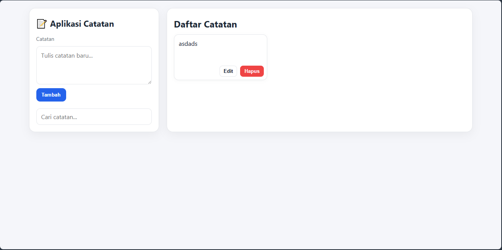

---

# 📝 Daily Notes App

A simple note-taking web application built with **HTML, CSS, and JavaScript**.
This project is designed as a daily push exercise (Day 1, Day 2, …) for GitHub practice.

---

## 🚀 Features

* Add new notes with title & content
* Delete notes
* Persistent storage using **LocalStorage**
* Responsive layout with search bar
* Notes aligned neatly on the right side

---

## 📂 Project Structure

```bash
daily-notes-app/
│── src/
│   ├── index.html     # Main HTML file
│   ├── style.css      # Styling (CSS)
│   ├── app.js         # Entry point, app initialization
│   ├── notes.js       # Notes model / structure
│   ├── script.js      # Main script runner
│   ├── storage.js     # LocalStorage utilities
│   └── ui.js          # UI rendering and interactions
│── README.md          # Documentation
│── LICENSE            # MIT License
```

---

## 🛠️ Installation & Running

1. Clone this repository

   ```bash
   git clone https://github.com/anzensirc/mobapp.git
   ```
2. Navigate into the project

   ```bash
   cd mobapp
   ```
3. Run 
   ```bash
   python -m http.server 5173
   ```
   Or Open `index.html` in your browser

   * Just double-click `index.html`, or
   * Run a local server (recommended):

     ```bash
     npx serve .
     ```

---

## 📸 Screenshot (Example)



---

## 📜 License

This project is licensed under the [MIT License](./LICENSE).

```
MIT License © 2025 [Your Name]
```

---

## 👨‍💻 Author

* GitHub: [Morgen Zen](https://github.com/anzensirc)
* Project maintained as part of **daily push routine**.

---

